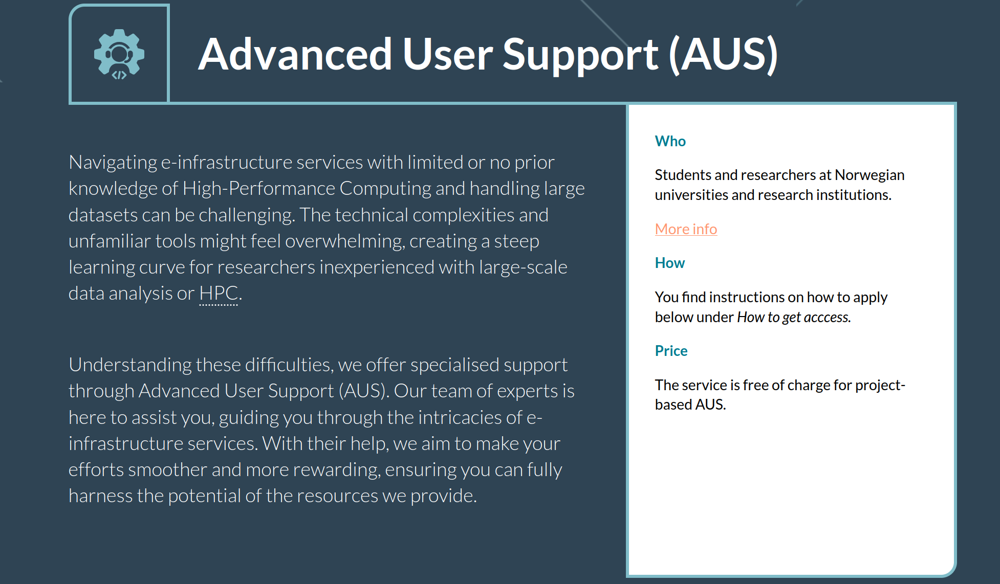
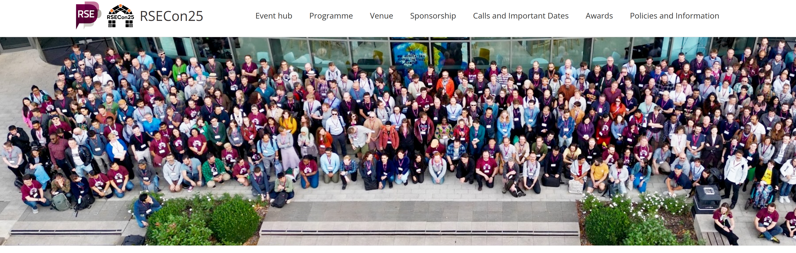
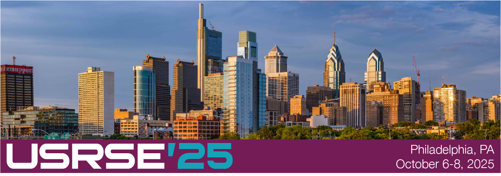
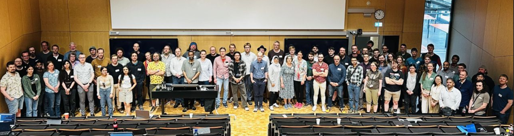

<!-- cicero
engine: remark
js:
  - https://cdnjs.cloudflare.com/ajax/libs/remark/0.14.0/remark.min.js
css:
  - slides.css
-->

# Research Software Engineering

- Programvareutvikling er en del av forskning

- RSE ingenjører utvikler og støtter programvaren forskere er avhengige av:
  - Innsamling, behandling, analyse og deling av data

  - Skriving av kode som er reproduserbar, gjenbrukbar og skalerbar

## Ressurser

- [Society of Research Software Engineering](https://society-rse.org/)
- [Nordic-RSE Association](https://nordic-rse.org/)
- [Nordic-RSE Conference 2026](https://nordic-rse.org/nrse2026/)

---

  

  

    Men mange forskere med stort behov for hjelp til data og programvare bruker ikke HPC-ressurser
  

---

# RSE er et globalt fagfelt

  

    
    
    
  

  

    2026 Nordic-RSE konferanse på UiT
  

