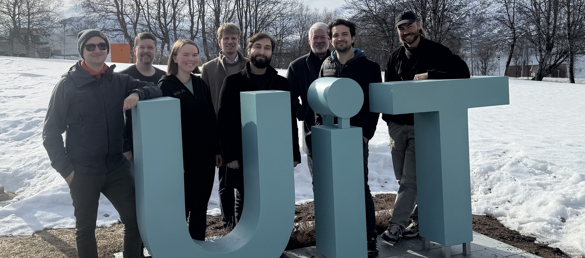

class: gray-background

<!-- &nbsp;   -->
&nbsp;  
&nbsp;  
.right-column50[

]

.left-column50[
# Research Software Engineering at UiT

]
<!-- &nbsp;   -->
<!-- &nbsp;   -->
<!-- &nbsp;   -->
<!-- &nbsp;   -->
<!-- &nbsp;   -->
<!-- # [research&#8209;software.uit.no](https://research-software.uit.no/) -->

---
# What changed to 2025?

- We have grown to 9 part time RSEs

- Enough projects for 3 full time RSEs

- Involvement in longer-term projects, including grant applications (more on that later)

- Research visits: OxRSE & University of Edinburgh

---
# New service levels

- **RSE Help Desk:**   2 hours on (almost) every Wednesday at the UiT Library (UB 338)    .emph[FREE] (first come/first serve)

- **Individual Consultations:**   One-on-one with an RSE engineer   Initial consultation free, afterwards 600 kr/hr (5-hour minimum)

- **Extended Collaborations:**    Part-time or full-time contracts with the RSE group   Include us in your grant applications! - 600kr/hr 

---

---

## RSE teaching at UiT

- RSEs are teaching in multiple courses:

 * FYS-8805 Collaborative Coding and Reproducible Research

 * Bio-3027 / Bio-8027 Scientific Programming with Python in the life sciences

 * BIO-3032 Big data and Artificial intelligence for environmental, ecological and biological science

 * FYS-3003 Space Physics

- Plans to develop dedicated RSE courses in the future

---

## Successful Grant applications

- FUSENOW (Trond Mohn Research Foundation / Tromsø Science Foundation) including part time RSE position for 5 years

- Dedicated funding for RSE work provided by NRIS (Norwegian Research Infrastructure Services) for multiple projects (including SpeedyWeather.jl)

- More to come soon!

---
## Current challenges

- RSE still unknown to many researchers at UiT (especially at campus in Narvik, Harstad, and Alta)

- Collaboration with startup incubator (Norinnova) didn't lead anywhere

- Most RSEs work part time, which makes it difficult to find time for longer-term projects

- Some RSEs have temporary contracts, creating uncertainty for both the RSEs and collaborators

- The unexpected logistical overhead of event planning (NRSE 2026)
---
class: center, middle, inverse

# RSE Help Desk: 
# Wednesday 14:00&#8209;16:00

## https://research-software.uit.no/contact/

## Email: rse@uit.no 

