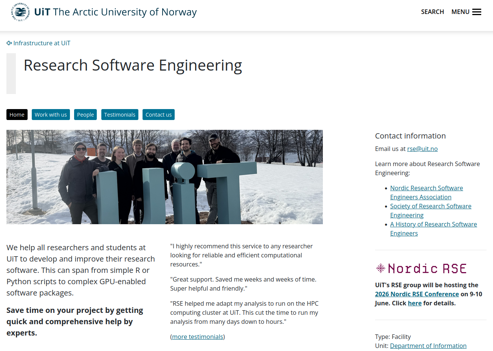
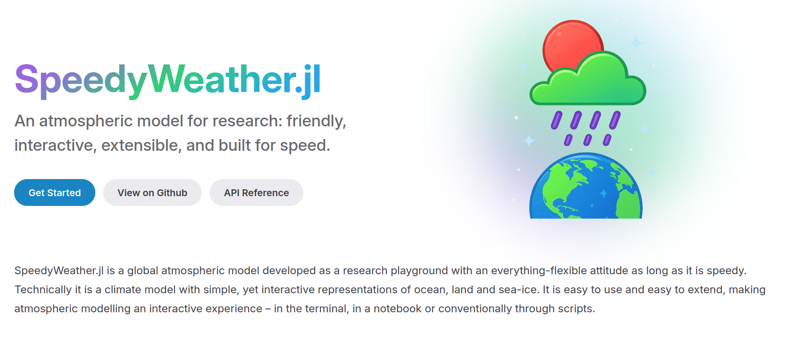
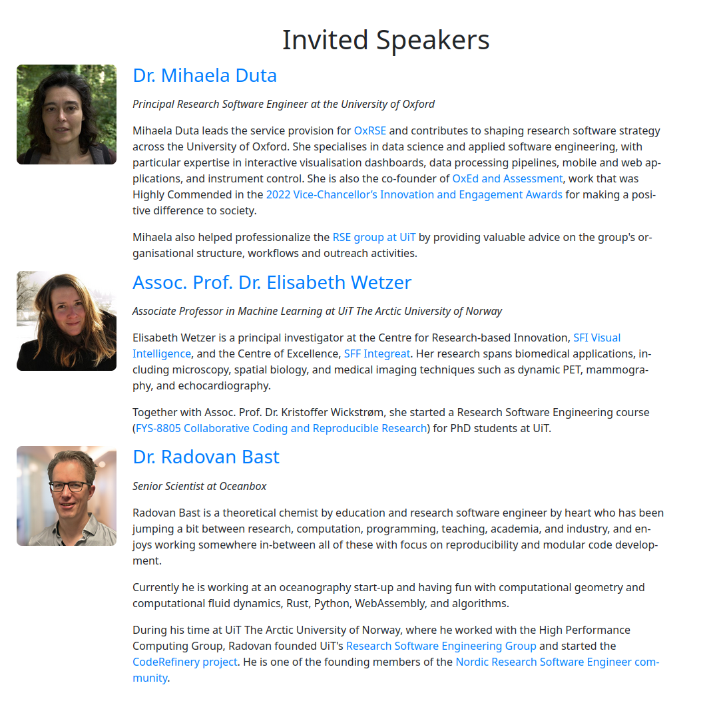

class: gray-background


<!-- &nbsp;   -->
&nbsp;  
&nbsp;  
.right-column50[


]

.left-column50[
# Research Software Engineering at UiT

]
<!-- &nbsp;   -->
<!-- &nbsp;   -->
<!-- &nbsp;   -->
<!-- &nbsp;   -->
<!-- &nbsp;   -->
<!-- # [research&#8209;software.uit.no](https://research-software.uit.no/) -->

---
# Software development is part of research

- Scientists typically spend **30%** of their time developing software

- 90% or more are primarily self-taught

- Many are unaware of tools and practices that would allow them to write **more reliable and maintainable code** with less effort

.cite[Wilson, Greg, et al. "Best practices for scientific computing." PLoS biology 12.1 (2014): e1001745.]

---

# Research software engineers

- ... are people who combine .emph[professional software expertise] with an .emph[understanding of research] .cite[https://researchsoftware.org/]

- Often people **who grew up in research** and liked computing and programming

- ... or people **who come from software development** drawn towards meaningful and impactful work of academia


## Resources

- [Society of Research Software Engineering](https://society-rse.org/)
- Recent conference: [RSECon 2025](https://rsecon25.society-rse.org/)
- https://nordic-rse.org/
- [Nordic-RSE conference 2025](https://nordic-rse.org/blog/nrse-conference-report/)


---


---



---

# Help with improving your scripts/code

- .emph[Collaborative code review] (we discuss code in a constructive way)
- Making code .emph[cleaner, faster, and more reusable]
- Best practices for documentation


---

# Help with organising your code

.left-column50[
- Git, GitHub, and GitLab

- Moving your work/project/code/data to Git

- Modularizing your code

- Organization of reusable Python/R notebooks
]

.right-column50[

]

---

# Help with sharing your code

.left-column50[
- Help with software licenses and open sourcing

- Publishing code

- Packaging and sharing software

- Containerization (Singularity, Docker)

- PyPI and Conda

- Journal of Open Source Software (JOSS)

]

.right-column50[

]

---

# Getting results sooner

.left-column50[
- Improving scaling, CPU, and memory optimization

- Porting to GPU

- Moving from local computer to cloud or high-performance computing clusters

- Helping with running independent steps in parallel
]

.right-column50[


.cite[Midjourney, CC-BY-NC 4.0]
]

---


---
# Work with us

- **RSE Help Desk:** <br> 2 hours on (almost) every Wednesday at the UiT Library (UB 338) <br>  .emph[FREE] (first come/first serve)

- **Individual Consultations:** <br> One-on-one with an RSE engineer <br> Initial consultation free, afterwards 600 kr/hr (5-hour minimum)

- **Extended Collaborations:**  <br> Part-time or full-time contracts with the RSE group <br> Include us in your grant applications! - 600kr/hr 

---


---
# Example 1: rewrite instead of buying a 30 GB hard disk

### Problematic if data is 30 GB big

```python
result = 0.0
with open("data.txt", "r") as f:
    lines = f.readlines()
    for line in lines:
        result += analyze(line)
```


### Better

```python
result = 0.0
with open("data.txt", "r") as f:
    for line in f:
        result += analyze(line)
```
---

# Example 2

Speed-up of grid mesh generation for oceanography code from days to seconds by a code
rewrite from Matlab to Python+Rust using a more optimal algorithm


---

# Example 3

.left-column50[
- Bioaccumulation model for organic contaminants developed for arctic ecosystems

- Translated 10k lines of 20+ year old Visual Basic code to Python 
]

.right-column50[

]


---

# Example 4




- Ported to AMD GPUs 

- Currently working on increasing performance using CUDA graphs and compiling into MLIR and XLA

---

.left-column50[
- Version control

- Collaboration using Git

- Testing

- Documentation

- Notebooks

- Modular code development

- Reproducible research

- Software licensing

- How to share and publish code
]

.right-column50[


**Typical format**: 6 half-days, [twice per
year](https://coderefinery.org/workshops/upcoming/), online, free,
live-streamed, recorded, archived asynchronous Q&A in collaborative document

**Lessons and recordings:** https://coderefinery.org/lessons/
]
---

## PhD course at UiT: FYS-8805 Collaborative Coding

- One week of lectures + home exam

- 5 credit points 

- Lecture material is public: [fys-8805-collaborative-coding.github.io/lecture-material](fys-8805-collaborative-coding.github.io/lecture-material)

- Next course: 25th–27th May & 11th–12th June

- **Let us know if you are interested!**


---
## UiT organizes the next Nordic RSE conference


more info at [nordic-rse.org/nrse2026](https://nordic-rse.org/nrse2026/)
---


---

&nbsp;  
&nbsp;  
# Har du lyst til å være med i det neste RSE-prosjektet?
&nbsp;  
&nbsp;  

## Hvis ja, ta kontakt enten personlig eller via rse@uit.no
---
class: center, middle, inverse

# RSE Help Desk: 
# Wednesday 14:00&#8209;16:00

## https://research-software.uit.no/contact/

## Email: rse@uit.no 

